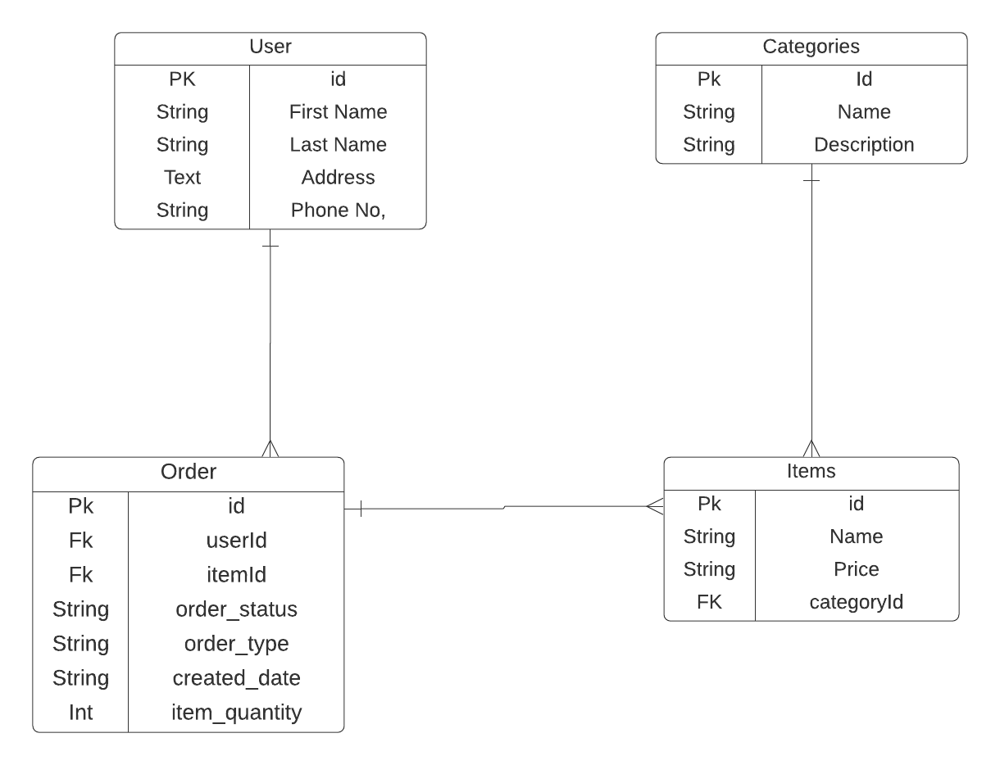

Readme

RESTAURANT

**Overview:**
The restaurant application provides users a convenient and accessible way to see the online menu as well as order online from Passion Foods Restaurant. This application provides users the ability to see all categories and items provided by this restaurant. The user is able to tell what the restaurant offers and the costs before going to the restaurant, providing the user with transparent information. Although this application was built for one specific restaurant in mind, this application can be extended to multiple restaurants and serve as a generic food ordering and menu platform.

**User stories:**
This application has two users: restaurant customers and restaurant owner.

User stories as a customer: As a user,
* I can see the whole menu
* I can order any item
* I can see the total price at the time of ordering
* I can choose the option for delivery and pickup
* I can add and delete items at time of ordering

User stories as a restaurant owner: As the owner,
* I can take order from customers
* I can let customers choose between pickup or delivery options
* I can take the payment at the time of ordering
* I can retrieve address and phone number if it is a delivery

**Challenges Faced:**
The order now, checkout, and place order parts of the application were challenging -- specifically, getting the data flow to work between them was challenging. These three parts of the application share the same data and have different needs for updates. Because a user action in one part affects the data that is needed for the other parts, getting the data flow correct between these three components is important to my application. I also simplified my original wireframes to move the form-related components to the PlaceOrder component instead of having some in PlaceOrder and others in Checkout component -- this helped me simplify the amount of data that had to be shared between components.

**Future Plans:**
Provide a dashboard to the restaurant owner that analyzes the sales to help owner plan for inventory of ingredients and to help owner determine which parts of the menu should be expanded.
Build an admin UI so that owner can add new item to menu, change the price of an item, and more.
Integrate the payment details with either the Paypal API or the Stripe API to be able to validate the provided payment details.
Extract this website into a platform for any restaurant.
Provide facilities to create sale reports -- this could be useful when this website is a platform for hosting restaurant websites instead of just one website for one restaurant.
Add advertisements on website to keep cost of website maintenance low since this is for a small business.
Allow user to provide feedback through a feedback component.

**What would I do differently?**
If I had more time, I could add more functionality such as providing time order can be expected to be ready, send notification to customer that order is ready for pick up, add multiple payment options. In terms of planning, I think next time, I would spend more time planning the data flow between the different pages of my application. I spent time planning wireframes, creating the entity models, thinking about user stories, but the biggest challenge was determining the data flow when data had to be shared and updated across multiple components.

**What am I most proud of?**
The order now and checkout components were challenging, so I am proud to have a working application with those data flows working. I am also proud to have been able to create both a backend service and a frontend UI, which seemed very difficult at the beginning of this course.

**What did I learn?**
How to Structure a project using different frameworks and technologies like Spring Boot, Angular etc.
Deploy an Angular app and a Spring Boot app on Heroku.
How to add dependencies for frameworks.
How to make a project production ready.
How to connect the frontend to the backend.
How to design an API with a specific frontend in mind.

**Technologies Leveraged:**
For Back-end:

 Spring Boot | API  Framework for Java
 Java 11    |Code Language
Maven
Java dependency management
Hibernate
Object Relational Mapping tool
PostgreSQL
Relational Database

For Front-end:
Angular
JavaScript framework
npm
Node Package Manager
Bootstrap
CSS framework
HTML
For layout
CSS
For styling
TypeScript
Typed JavaScript
JSON
Data interchange format

Artifacts

[Website Wireframe](documentationImages/Website.png)

# RestaurantFrontEnd

This project was generated with [Angular CLI](https://github.com/angular/angular-cli) version 11.2.12.

## Development server

Run `ng serve` for a dev server. Navigate to `http://localhost:4200/`. The app will automatically reload if you change any of the source files.

## Code scaffolding

Run `ng generate component component-name` to generate a new component. You can also use `ng generate directive|pipe|service|class|guard|interface|enum|module`.

## Build

Run `ng build` to build the project. The build artifacts will be stored in the `dist/` directory. Use the `--prod` flag for a production build.

## Running unit tests

Run `ng test` to execute the unit tests via [Karma](https://karma-runner.github.io).

## Running end-to-end tests

Run `ng e2e` to execute the end-to-end tests via [Protractor](http://www.protractortest.org/).

## Further help

To get more help on the Angular CLI use `ng help` or go check out the [Angular CLI Overview and Command Reference](https://angular.io/cli) page.
